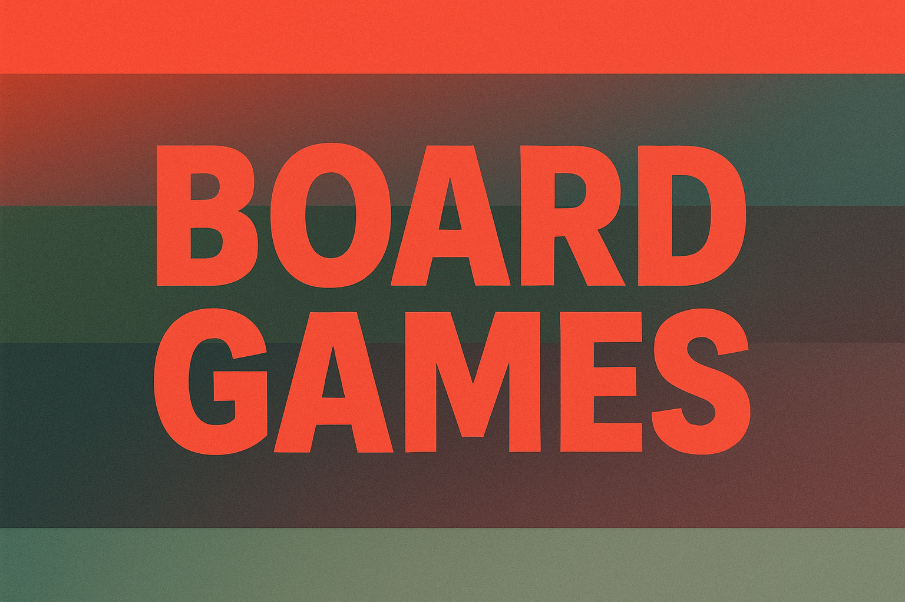

# Decoding Success: Key Drivers of Board & Card Game Campaigns on Kickstarter

An overall analysis on how to get into the board games market through Kickstarter website successfully

## DATA HANDLING PROCESS BY STEPS
- We began by filtering the dataset to include only entries under the "Games" category and the "Board Games" subcategory.
- We identified a duplicate subcategory due to a typo and merged it into a single, consistent "Board Games" subcategory.
- To estimate the launched date, we subtracted the duration (converted to integers for smoother calculations) from the funded date.
  ```
  df['lanuched date'] = df['funded date'] - pd.to_timedelta(df['duration'], unit='D')
  ``` 
- The only null values were in the Location column. Since there were just 11 missing entries, we manually filled them by referencing the creators' websites.
- We removed one duplicate entry based on its unique ID.
- To simplify comparison, we cleaned the "Reward Levels" column, extracted the numeric values, and created two new columns representing the maximum and minimum reward amounts.


## DATA DICTIONARY

| Field                 | Description |
|-----------------------|------------|
| project id           | The unique identifier for each project on the Kickstarter platform. |
| name                 | The name of the project. |
| url                  | The link to the project's page on Kickstarter. |
| category             | The main category the project belongs to (e.g., Film, Music, Technology). |
| subcategory          | The more specific subcategory that defines the project's type in more detail. |
| location             | The city and state where the project originates. |
| status               | The status of the project (Successful, Failed, or still Active—“live”). |
| goal                 | The target amount of money the creator aims to raise through crowdfunding. |
| pledged              | The actual amount of money pledged by backers. |
| funded percentage    | The percentage of the goal that was funded. |
| backers              | The number of backers who contributed to the project. |
| funded date          | The date the project successfully met its funding goal (if applicable). |
| levels               | The number of reward tiers offered. |
| reward levels        | The different monetary values of rewards offered to backers. |
| updates              | The number of updates the creator posted. |
| comments             | The number of comments received on the project. |
| duration             | The number of days the project was active for funding. |
| launched date        | The date obtained by subtracting the duration from the funded date. |
| reward levels cleaned | To simplify the identification of minimum and maximum values. |
| reward_min           | The minimum reward value. |
| reward_max           | The maximum reward value. |
## QUANTITATIVE DATA ANALYSIS

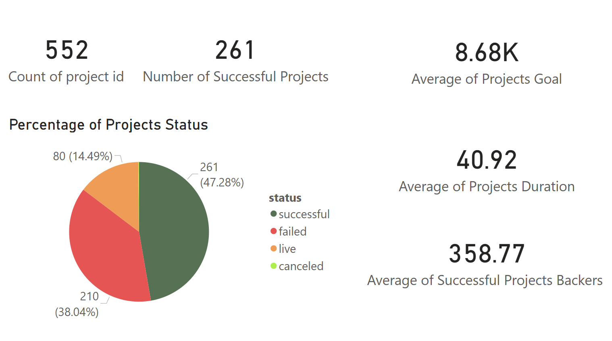

 Nearly half of the Kickstarter board game projects (47%) were successful, likely because creators set realistic goals (around $8.7K on average), had enough time to promote (about 41 days), and attracted decent support: each successful project pulled in over 350 backers on average. However, a large number still failed or are currently live, possibly due to limited exposure, unclear messaging, or competition. Overall, the success seems tied to achievable targets, strong community interest, and smart promotion. 
 
### DATA LIMITATIONS
- Insufficient data is available.
- There is no subcategory that specifically defines board games.
- The data is outdated and may not accurately reflect the current market.
- We couldn't fully take advantage of live projects since their success status is unknown. One possible solution is to use web scraping to retrieve their latest status for a more accurate analysis.
- It would be more beneficial to have comments in text format rather than just numbers, enabling deeper analysis.

## QUALITATIVE ANALYSIS

### 1. LAUNCH TIMING
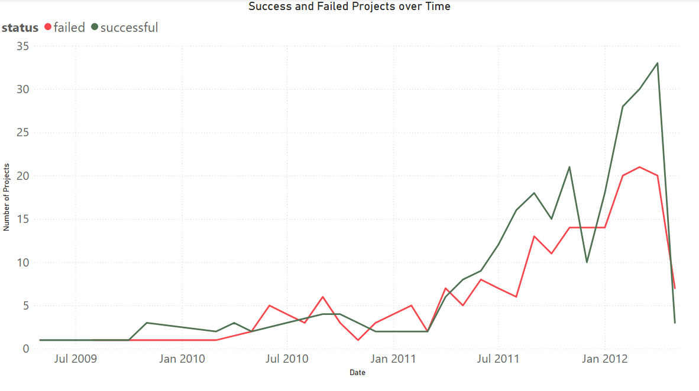
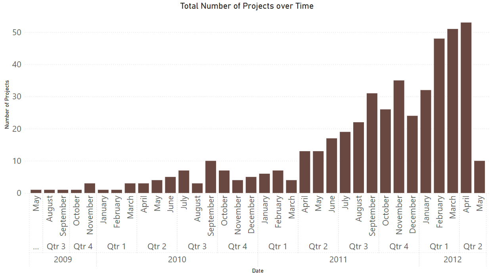

### 2. CAMPAIGN DURATION
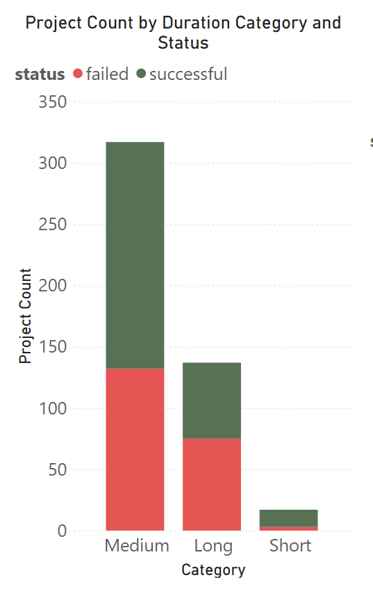
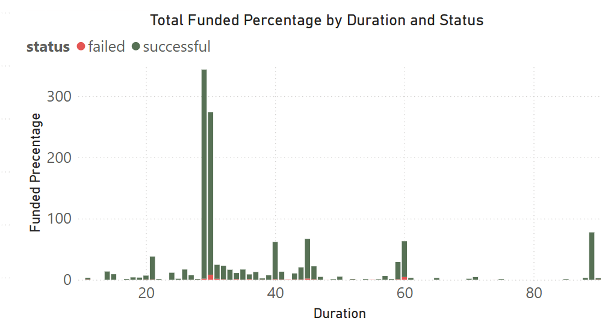

### 3. FUNDING GOAL 
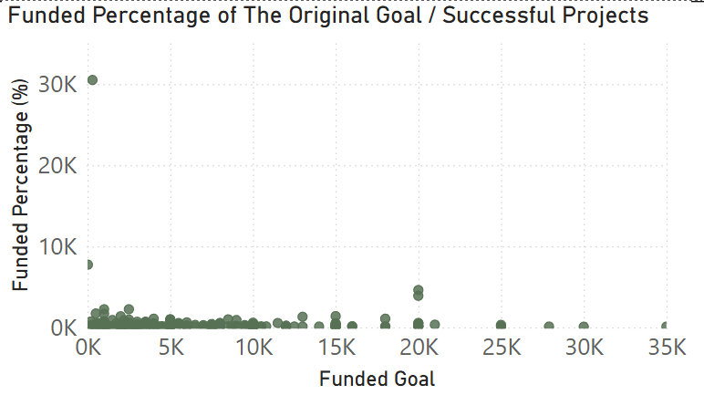
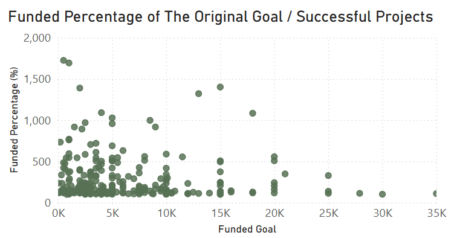
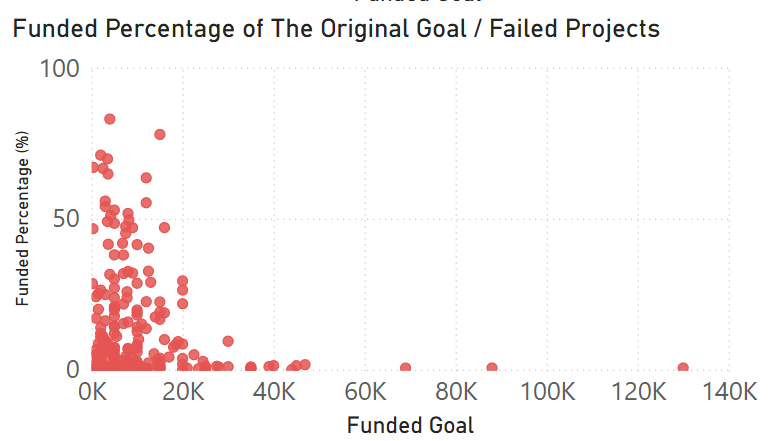

### 4. REWARD TIER PRICING 
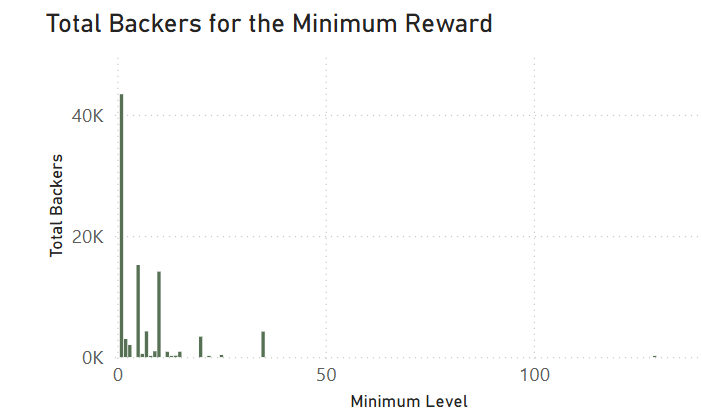
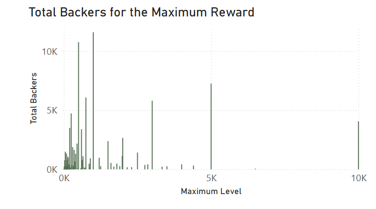
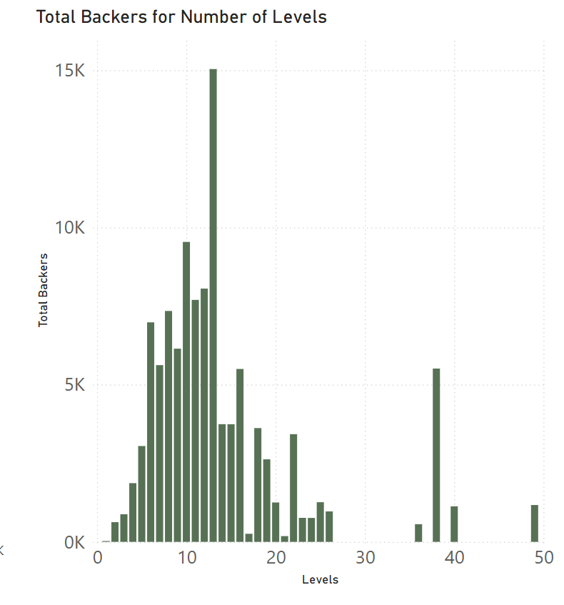

### 5. BACKER ENGAGMENT 
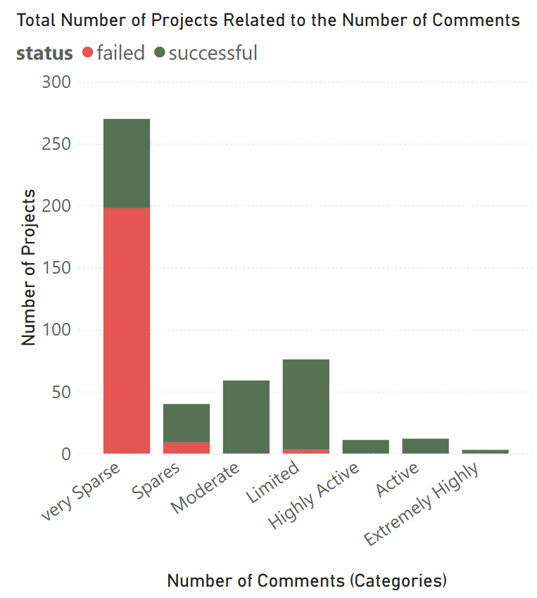
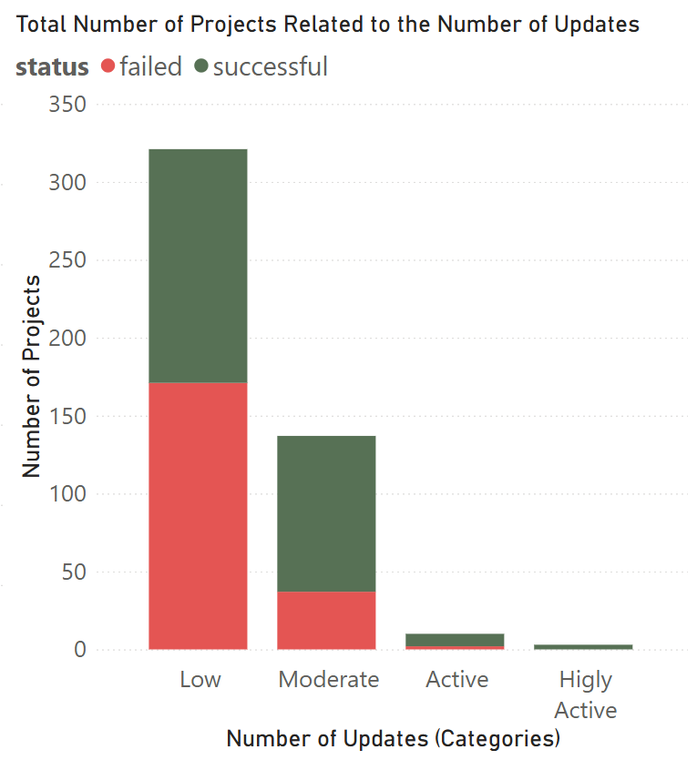

### 6. EXAMPLE OF HIGH SUCCESS
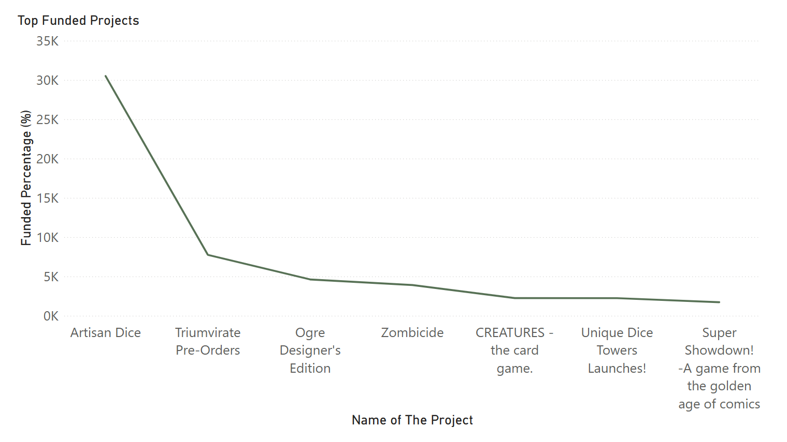

## RECOMMENDATIONS 
1. Keep funding goal under $10,000.
2. 5 to 15 reward tiers recommended.
3. Start rewards at $10–$20 minimum.
4. Offer higher-tier special editions for premium backers.
5. Target duration between 21 to 45 days.
6. Minimum 10 updates throughout the campaign.
7. Encourage >20 comments through active communication.


